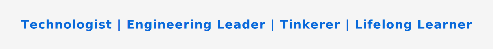

## Kartik Shankar  
 

  

 

> **_On GitHub to learn -> build -> break -> fix -> fail -> retry -> succeed -> share._** Rinse and Repeat
 

## About Me

I'm a technology leader passionate about building innovative solutions and leading happy, and high-performing engineering teams that delight customers.

- Currently running tech at 3 companies:
  1. Founder and CEO at [Anjaneya Innovations](https://anjaneyainnovations.com/) (Technolody and Advisory/Consulting firm)
  2. CTO and Co-Founder at [AXCL](https://axcl.com/) - Urban Transportation
  3. CTO and Strategic Advisor at [Sentry](https://sentryms.com/) - Transit Tech
- Previously at Jefferies, Morgan Stanley, Microsoft, CA Broadcom.
- Continuously exploring emerging technologies and innovation. (so the GitHub contribution graph turns more green 🟩 🟩 😀 )
- Committed to lifelong learning.
- Curious about everything!

## Connect With Me

  
  
  
  
  
  

 

  
<i>Thank you for visiting my profile. I'm always open to interesting conversations and collaboration opportunities.</i>

